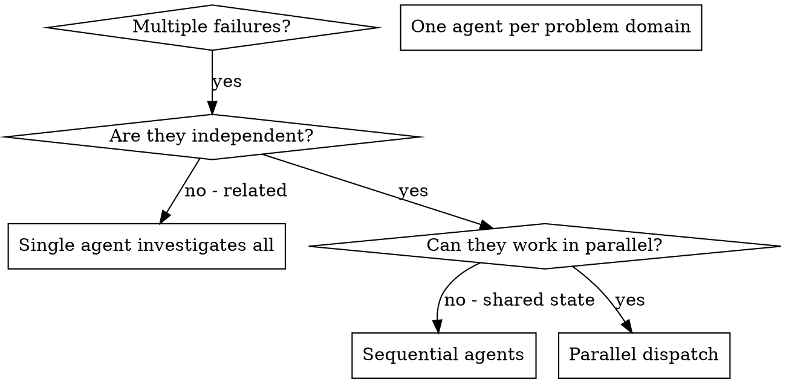

# Dispatching Parallel Agents

## User policy for Codex projects

Within applicable project instructions, AGENTS.md rules, and authorization boundaries, apply this current user policy to independent implementation tasks as well as investigations. It supersedes older role assignments and the generic examples below without weakening higher-priority instructions or project-specific governance.

- Use GPT-6 Astra (`gpt-6-astra`) for read-only research, analysis, dependency planning and execution maps, coordination/dispatch, code review, integration decisions about required corrections, and final evidence assessment/summary. Astra does not edit implementation, documentation, or ticket/Flow records; it reports findings and requests execution.
- Delegate 100% of execution to GPT-5.6 Luna (`gpt-5.6-luna`) with reasoning effort `max`: implementation, integration edits, review-driven fixes, documentation and authorized ticket/Flow record updates, and all test execution. Luna does not self-approve; Astra performs the read-only review and final evidence assessment. The current spawn tool supports Luna through `max`, not `ultra`. Check the runtime tool schema before dispatch; do not silently substitute another model or effort if unavailable.
- Follow this handoff sequence: Astra researches, analyzes, plans dependencies, and dispatches; Luna implements and integrates; Astra reviews the actual changes read-only; Luna applies authorized fixes and documentation updates; Luna runs the final tests; Astra performs the final read-only review and evidence summary. If final fixes or tests change reviewed content, repeat Astra's review and the affected tests; never reuse stale approval or fabricate signoff.
- A skill cannot change the running main model. If Astra is the main model, it performs research/analysis/planning/coordination and routes execution to Luna; if Luna is the main model, it requests Astra for those activities and for read-only review, then executes the authorized work. State the actual model and role handoff; do not claim that the skill switched models. If a required model is unavailable, report that explicitly rather than silently substituting another model or effort.
- Luna may run useful scoped tests during implementation. Final test evidence follows the final code, documentation, and authorized ticket/Flow edits after review fixes; record-only changes need applicable documentation checks, while broader runtime tests should be repeated when behavior changed.
- When authorized to update records, Luna records Astra's actual review verdict, evidence, and blockers faithfully. Luna never self-approves or manufactures Astra approval or signoff.
- Identify prerequisite edges and file/resource ownership first. Dispatch ready, independent work together without waiting for unrelated tasks. Wait only for actual prerequisites or capacity limits. Keep useful coordination/review work moving while implementers run.
- Give each agent a self-contained brief: goal, repository/worktree and baseline, owned files, interfaces, prerequisites, acceptance criteria, test commands, and expected report. Use `fork_turns: "none"` when specifying model/effort overrides with Codex collaboration tools.
- Prefer peer implementers under the main coordinator. Nested delegation is allowed for a concrete independent subtask if it improves throughput; keep implementation on Luna `max`, report ownership to the main, and respect the shared live-agent limit. Do not spawn duplicate work or create separate user-owned Codex tasks for subtasks.
- Shared filesystem writes must have disjoint ownership; coordinate shared contracts, migrations, fixtures, ports, and services. Use separate worktrees where useful, but do not assume they isolate shared runtime resources. Preserve unrelated changes.
- Astra reviews the actual diff and available test evidence read-only, sends needed implementation corrections back to Luna, and assesses the integrated result after Luna runs tests appropriate to the affected scope. Run the full relevant suite when required by the task or project. Do not infer full acceptance from scoped tests.
- Keep task/Flow lifecycle changes within the project's governing workflow. Luna may make documentation or ticket/Flow record updates only when authorized; Astra reviews those changes read-only. Delegation does not grant permission to commit, push, deploy, publish, or close a Flow.

This is a local customization of `obra/superpowers`' `dispatching-parallel-agents`; preserve this policy when updating the upstream skill.

## Flow and ticket overview before dispatch

For ticket/Flow work, perform this overview before spawning implementation agents, even when the user has not already identified independent tasks. For a standalone task, apply the same reasoning to its subtasks without inventing a ticket system.

### Establish scope and current evidence

Read the requested Flow, its member tickets, relevant specifications/source of truth, and linked prerequisites or consumers needed to assess the affected interfaces. Identify each ticket by repository plus ID; IDs may repeat across repositories. Inspect the actual checkout, branch/commit, existing changes, active agents, and relevant code before relying on recorded status. Limit exploration to the requested scope and dependencies that affect the decision.

Reviewing the whole Flow does not authorize implementing every ticket in it. Preserve the user's authorized implementation scope. A review-only request produces a proposed schedule without starting implementation or changing lifecycle state. Use the project's applicable ticket/Flow governance instructions and skills when interpreting or updating that system.

### Separate development prerequisites from later gates

For each dependency, record what artifact or condition is needed, the evidence supporting it, and which stage it blocks:

- **Development:** Work cannot be implemented correctly until an interface, decision, schema, or upstream artifact exists.
- **Integration/runtime:** Independent development can proceed against an established contract, but combined or real-runtime verification must wait.
- **Acceptance/release:** Review, sign-off, deployment, or ticket/Flow closure must wait; this does not automatically block development unless the project's rules explicitly say so.
- **Shared resources:** Files, migrations, generated outputs, databases, ports, services, or other state require exclusive ownership or an agreed schedule.

An open predecessor ticket alone does not prove that all downstream development is blocked. Conversely, separate ticket names or directories do not prove independence. If a declared dependency is ambiguous, inspect its reason and governing specification; keep the dependent part pending when the prerequisite remains uncertain, while advancing supported independent work. Do not silently remove or reinterpret explicit governance gates.

Split partially blocked tickets into bounded deliverables when useful. A pure module, UI component, adapter, or contract test may proceed if its needed inputs are established and its files/resources can be owned separately. Mark contract-backed fixtures or mocks as local evidence; they do not satisfy real integration or acceptance gates. Do not invent a contract merely to create parallel work.

### Publish a compact execution map

Before implementation dispatch, present a concise table or equivalent covering every in-scope deliverable. Group genuinely equivalent rows for large Flows:

| Repo / ticket / deliverable | Current evidence | Development prerequisites | Integration / acceptance gates | File and resource owner | Ready now or blocked, with reason |
| --- | --- | --- | --- | --- | --- |

Identify the first ready group, later dependency edges, any shared-contract work that must happen first, and the planned integration checks. This is a reviewable plan, not a new approval gate when implementation is already authorized. If nothing benefits from parallel execution, explain the concrete dependency and continue sequentially.

### Schedule and reassess continuously

Dispatch ready deliverables up to the available capacity, prioritizing work that unlocks downstream tasks. Groups are a planning aid, not a barrier: start newly unblocked work as soon as its prerequisite is verified and a slot is available, without waiting for unrelated agents in the same group.

Assign a single owner to shared contracts, migrations, or integration files. Settle required interface decisions before dependent implementation. If ownership cannot be separated, serialize the affected writes or use isolated worktrees with an explicit integration owner; shared runtime resources still need coordination.

After Luna finishes or discovers a changed dependency, Astra checks the actual changes and relevant evidence read-only, updates the execution map, and releases only the deliverables whose prerequisites are now met. Notify affected agents of interface changes and revalidate their assumptions. Luna owns implementation, integration fixes, authorized documentation/ticket records, and test execution; Astra owns research, coordination, review, and final evidence assessment. Keep implementation, tests, integration, review, and acceptance status distinct; an agent's completion report alone does not close a ticket or Flow.

### Decision examples

- Backend and UI tickets share a documented API contract: develop in parallel with separate ownership; real end-to-end verification waits for the backend runtime.
- A predecessor awaits release approval but its required contract is stable: downstream development may proceed if project rules permit; release remains blocked.
- Two features require an undecided schema or edit the same migration: resolve the schema and assign its owner first; unrelated pure logic may proceed meanwhile.
- A user requests only one ticket in a larger Flow: inspect neighbors to understand dependencies, but dispatch implementation only for the authorized ticket's deliverables.

## Overview

You delegate tasks to specialized agents with isolated context. By precisely crafting their instructions and context, you ensure they stay focused and succeed at their task. They should never inherit your session's context or history — you construct exactly what they need. This also preserves your own context for coordination work.

When you have multiple unrelated failures (different test files, different subsystems, different bugs), investigating them sequentially wastes time. Each investigation is independent and can happen in parallel.

**Core principle:** Dispatch one agent per independent problem domain. Let them work concurrently.

## When to Use



**Use when:**
- 3+ test files failing with different root causes
- Multiple subsystems broken independently
- Each problem can be understood without context from others
- No shared state between investigations

**Do not dispatch implementation yet when:**
- Failures are related (fix one might fix others)
- Needed system context or contracts have not yet been established
- Agents would interfere with each other

## The Pattern

### 1. Identify Independent Domains

Group failures by what's broken:
- File A tests: Tool approval flow
- File B tests: Batch completion behavior
- File C tests: Abort functionality

Each domain is independent - fixing tool approval doesn't affect abort tests.

### 2. Create Focused Agent Tasks

Each Luna implementation agent gets:
- **Specific scope:** One test file or subsystem
- **Clear goal:** Make these tests pass
- **Constraints:** Don't change other code
- **Expected output:** Summary of what you found and fixed

### 3. Dispatch in Parallel

Astra issues all ready Luna implementation dispatches in the same response — they run in parallel:

```text
Luna (`gpt-5.6-luna`, `max`): "Fix agent-tool-abort.test.ts failures"
Luna (`gpt-5.6-luna`, `max`): "Fix batch-completion-behavior.test.ts failures"
Luna (`gpt-5.6-luna`, `max`): "Fix tool-approval-race-conditions.test.ts failures"
# All three run concurrently.
```

Submit each independent dispatch without waiting for earlier agents to finish. Tool-call message boundaries do not determine concurrency; the agents' running lifetimes do.

### 4. Review and Integrate

When Luna returns:
- Astra reads the summary and reviews the actual changes and evidence without editing them.
- Astra identifies conflicts or required corrections and sends a bounded implementation brief to Luna.
- Luna integrates authorized changes, applies review fixes, updates authorized documentation or ticket records, and runs the affected and required final tests.
- Astra performs the final read-only evidence assessment. If final fixes or tests changed reviewed content, repeat Astra's review and the affected tests before reporting a verdict.

## Agent Prompt Structure

Good agent prompts are:
1. **Focused** - One clear problem domain
2. **Self-contained** - All context needed to understand the problem
3. **Specific about output** - What should the agent return?

```markdown
Fix the 3 failing tests in src/agents/agent-tool-abort.test.ts:

1. "should abort tool with partial output capture" - expects 'interrupted at' in message
2. "should handle mixed completed and aborted tools" - fast tool aborted instead of completed
3. "should properly track pendingToolCount" - expects 3 results but gets 0

These are timing/race condition issues. Your task:

1. Read the test file and understand what each test verifies
2. Identify root cause - timing issues or actual bugs?
3. Fix by:
   - Replacing arbitrary timeouts with event-based waiting
   - Fixing bugs in abort implementation if found
   - Adjusting test expectations if testing changed behavior

Do NOT just increase timeouts - find the real issue.

Return: Summary of what you found and what you fixed.
```

## Common Mistakes

**❌ Too broad:** "Fix all the tests" - agent gets lost
**✅ Specific:** "Fix agent-tool-abort.test.ts" - focused scope

**❌ No context:** "Fix the race condition" - agent doesn't know where
**✅ Context:** Paste the error messages and test names

**❌ No constraints:** Agent might refactor everything
**✅ Constraints:** "Do NOT change production code" or "Fix tests only"

**❌ Vague output:** "Fix it" - you don't know what changed
**✅ Specific:** "Return summary of root cause and changes"

## When NOT to Use

**Related failures:** Fixing one might fix others - investigate together first
**Need full context:** Establish the required overview first, then reassess independent work
**Exploratory debugging:** You don't know what's broken yet
**Shared state:** Agents would interfere (editing same files, using same resources)

## Real Example from Session

**Scenario:** 6 test failures across 3 files after major refactoring

**Failures:**
- agent-tool-abort.test.ts: 3 failures (timing issues)
- batch-completion-behavior.test.ts: 2 failures (tools not executing)
- tool-approval-race-conditions.test.ts: 1 failure (execution count = 0)

**Decision:** Independent domains - abort logic separate from batch completion separate from race conditions

**Dispatch:**
```
Agent 1 → Fix agent-tool-abort.test.ts
Agent 2 → Fix batch-completion-behavior.test.ts
Agent 3 → Fix tool-approval-race-conditions.test.ts
```

**Results:**
- Agent 1: Replaced timeouts with event-based waiting
- Agent 2: Fixed event structure bug (threadId in wrong place)
- Agent 3: Added wait for async tool execution to complete

**Review and integration:** Astra's read-only review found no conflicts; Luna integrated the fixes and ran the final suite, which was green.

## Verification

After Luna returns:
1. **Review each summary** - Astra understands what changed and checks the actual diff read-only
2. **Check for conflicts** - Astra identifies whether Luna agents edited the same code
3. **Integrate and test** - Luna applies authorized corrections and runs affected-scope tests and the full relevant suite when required
4. **Spot check and assess evidence** - Astra performs the final read-only assessment; repeat review and affected tests if final changes alter reviewed content
